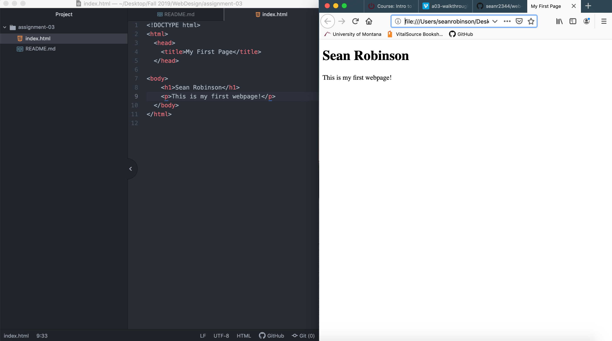

  # Assignment-03
  ## Sean Robinson

  1. Browsers function by processing the HTML, which may include text, links, and references to images and other items, such as cascading style sheets and JavaScript functions. The browsers I use is Firefox and Google.
  2. Markup language are designed for the processing, definition and presentation of text. HTML is an language commonly used in development.
  3. 
