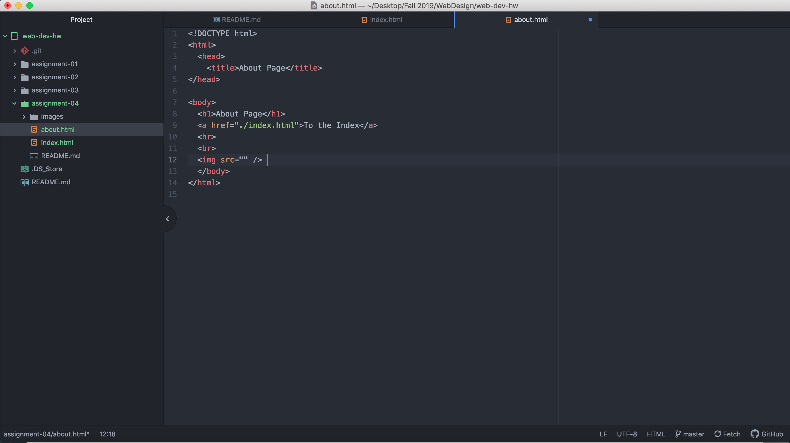

# Assignment 04
## Sean Robinson

1. Using The Wayback Machine I went to the 1998 Google search engine. What it looked like was boxy, pixelated, big font letters and dry colors. How it has changed is dramatic shifts in the font, color, layout, and clean crisp detail in the picture.

2. My experience with the GIT Module was good. I learned how to navigate through the module and learned the basic buttons and procedures. It was difficult at first, but it got easier as time went on.

3.
